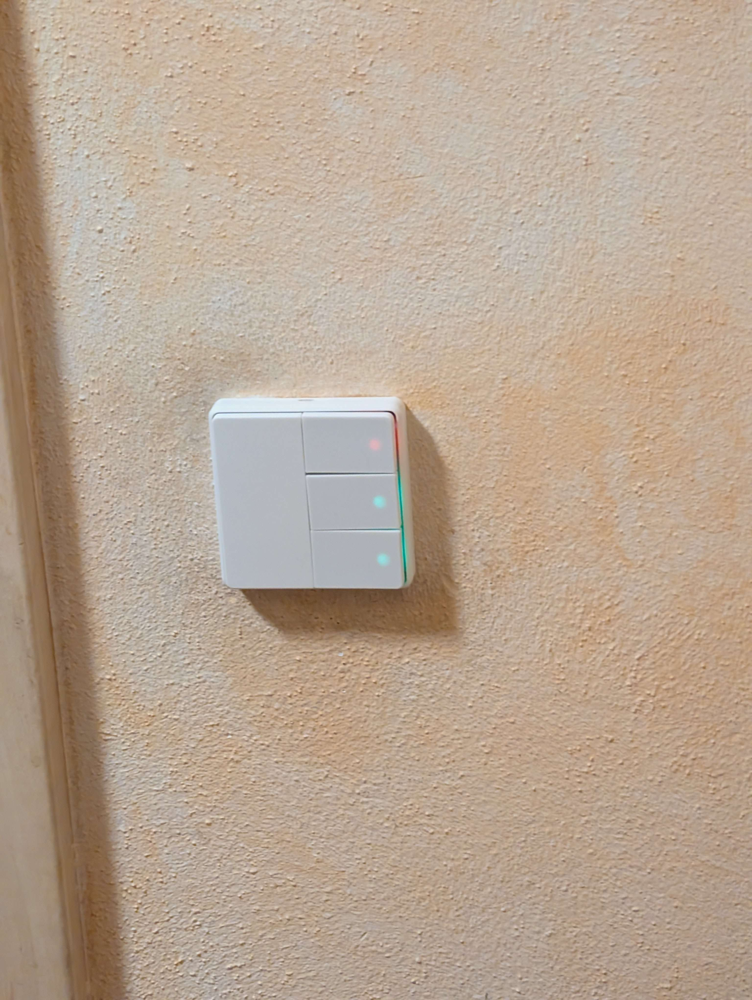
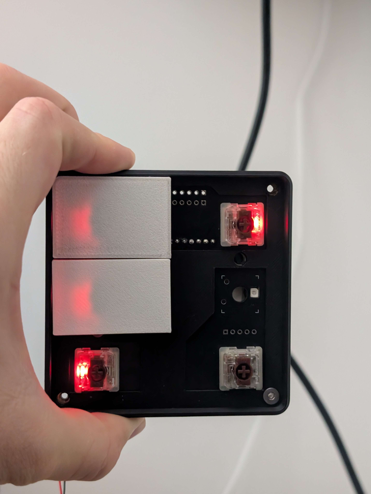
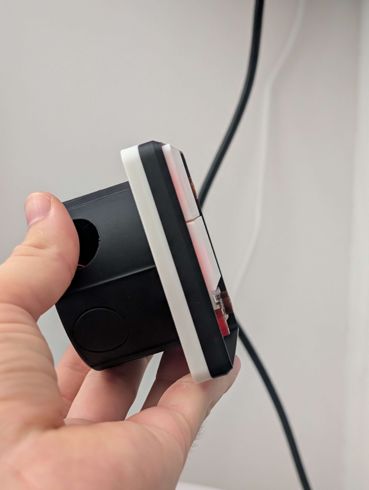
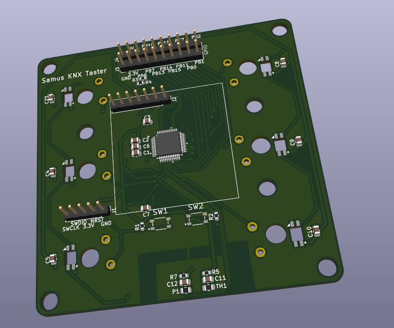
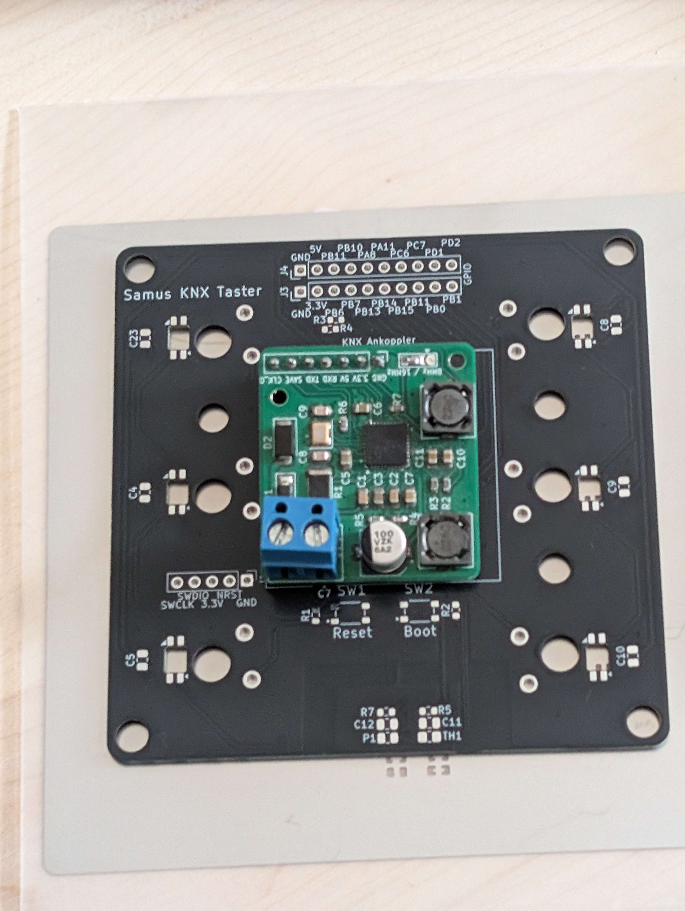
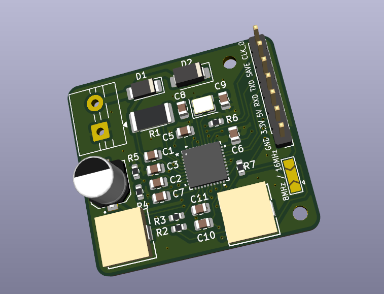

# KNX Taster v1

Custom 6-button KNX wall controller — designed, built, and installed in my own apartment.

**Status:** deployed at home since Summer 2026 · **v2 in development**

---

## The project

Off-the-shelf KNX wall controllers are functional but expensive, and rarely fit the exact button layout or feedback style I wanted. So I built my own — from schematic and PCB layout in KiCAD, through firmware on an STM32, to a fully 3D-printed enclosure and switch frame. It has been the primary KNX switch in my hallway since Summer 2026.

---

## Design highlights

**Own KNX protocol stack.** Rather than pulling in an off-the-shelf KNX library, the firmware implements the KNX bus stack from scratch on the STM32 — a deliberate learning project to actually understand the protocol layer by layer. ETS integration is currently being developed; migration to an established stack is on the table for v2.

**6 mechanical buttons with individual RGB backlight.** Gateron Brown key switches under 3D-printed frosted white button caps for even light diffusion. Per-key colour via SK6812MINI addressable LEDs — used to indicate state, group, or feedback.

**Modular KNX interface.** The KNX bus front-end (NCN5130-based) sits on a small daughterboard that plugs into the main PCB. This kept the bus-facing electronics isolated during development and let the coupler be revised independently — a pattern I now use whenever a design has a risky or reusable subsystem.

**Integrated environmental sensors.** NTC thermistor for room temperature and a photoresistor for ambient light — both onboard, no external module required.

**Fully 3D-printed housing and wall frame.** No off-the-shelf switch frame — even the standard-format wall frame is printed, so the whole assembly is one coherent design. Standard European mounting depth, drops into any existing flush-mount box.

**Full firmware development flow.** Onboard SWD debug header, dedicated Reset and Boot0 buttons — no jumpers or bodge wires needed to flash or debug.

---

## Gallery

*Front side under RGB feedback — buttons lit through frosted 3D-printed caps*

*Enclosure depth — fits a standard European flush-mount box*

*Main board, KiCAD 9 3D render — MCU, buttons, sensor cluster, coupler socket*

*Assembled main board with the modular KNX Ankoppler plugged into its socket*

*KNX Ankoppler daughterboard — NCN5130 bus front-end with 8/16 MHz reference*

---

## Hardware overview

### Main board

| | |
|---|---|
| **MCU** | STMicroelectronics STM32G070CBT6 (Cortex-M0+, 48-pin LQFP) |
| **Switches** | 6× Gateron Brown mechanical |
| **Indicators** | 6× SK6812MINI addressable RGB LEDs |
| **Sensors** | 10 kΩ NTC thermistor · GL-series photoresistor |
| **Debug** | SWD header (SWDIO, SWCLK, NRST, 3V3, GND) |
| **Expansion** | 2×10 GPIO breakout |
| **Coupler interface** | 1×7 pin socket for KNX Ankoppler |
| **User controls** | Reset · Boot0 |

### KNX Ankoppler (daughterboard)

| | |
|---|---|
| **Transceiver** | ON Semiconductor NCN5130 — full KNX bus front-end |
| **Reference** | 16 MHz crystal (jumper-selectable 8 / 16 MHz) |
| **Bus protection** | TVS diode (SMA40), series resistor + rectifier |
| **Power out** | Regulated 3.3 V and 5 V to the main board |
| **Bus connector** | 2-pin screw terminal (KNX+, GND) |

### Enclosure

- 3D-printed housing in black PLA
- 3D-printed frosted white button caps for LED diffusion
- 3D-printed wall frame in standard European 55 mm format

---

## Firmware

Written in C on the STM32G070, developed in **STM32CubeIDE**. The KNX protocol stack is a custom implementation running directly on the MCU, communicating with the KNX bus through the NCN5130 coupler board. The firmware also drives the RGB LEDs, samples the two sensors, and handles button debouncing.

*The firmware source is not published in this repository — this repo documents the project, it is not an open-source release.*

---

## What v2 will change

- **Single-PCB design.** Merge the main board and the KNX Ankoppler into one PCB — smaller footprint, fewer connectors, cleaner build.
- **Improved 3D-printed enclosure and mechanics.** Better fit, cleaner light guides, more repeatable assembly.
- **Software refinements.** Cleaner architecture, potentially migrating to an established KNX stack.
- **Extended functionality.** Additional features on top of what v1 delivers today.
- **Improved user interaction.** Refined feedback and control patterns.

---

## Tooling

- **Schematic + PCB:** KiCAD 9
- **Mechanical / Enclosure:** Fusion 360
- **3D Printing:** Bambu Lab P1S (PLA)
- **Firmware IDE:** STM32CubeIDE

---

## License

This project's documentation is released under the MIT License — see [LICENSE](LICENSE).

Full schematics, PCB source files, firmware source, and CAD files are **not** published in this repository. This is a project showcase, not an open-hardware release.

---

## Author

**Samuel Hoppe** — ISE student @ OTH Regensburg  
[GitHub](https://github.com/samu-studio) · [LinkedIn](https://www.linkedin.com/in/samuel-hoppe-a228aa323/)
